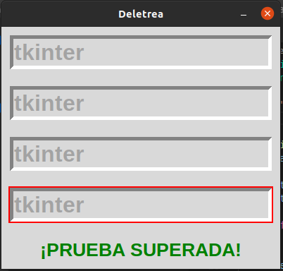
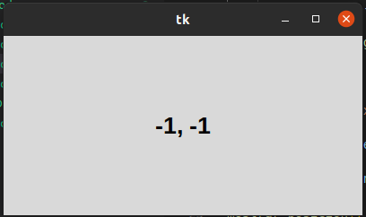
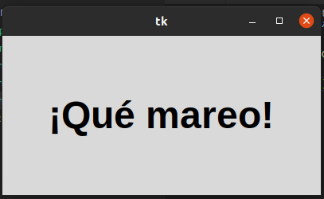

# 3. METODOS COMUNES

## METODOS COMUNES FOCO

### este gestor  va cambiando en cierto tiempo el foco donde se escribe, si se escribe en todas la palabra tkinter,se gana

### Nos muestran las coordenadas del raton mientras nos movemos.

## METODOS COMUNES POSICION RATON

### se aumenta o disminuye el tamaño de la letra en un intervalo de tiempo

## METODOS COMUNES TEMPORIZADOr

