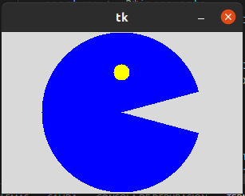
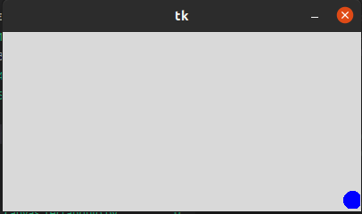
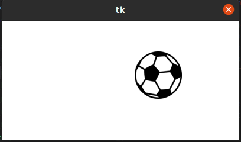
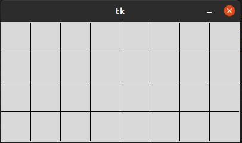
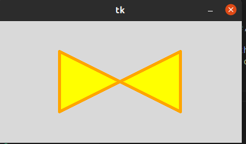
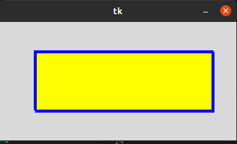
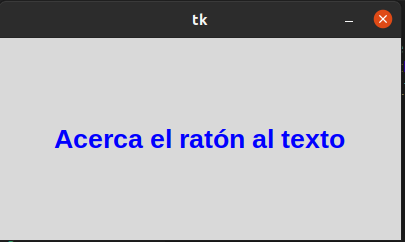
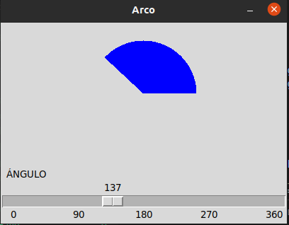

## ejercicio _canvas
## canvas arc
###  esto es un medio circulo con ojos que tiene movimiento es similar a un video juego

## canvas circulo
### esto es una pelota  con movimiento que se desplaza por todos los lados revotando

## canvas imagen
### esto nos muestra como una imagen tiene un movimiento en la ventana

## canvas lineas
### esto nos muestra una ventana que contiene una cuadricula

## canvas poligono
### en esta parte nos muestran una ventana que contiene un poligono de color amarillo

## canvas rectangulo
### en esta ventana nos muestran un rectangulo amarillo con un borde azul

## canvas text
### esta ventana nos muestra una frase que al acercar el maus cambia de color 

## scale arco
### esto nos sirve para medir un angulo segun los grados dados
