## ejercicio 5 widgets
## button
### esto nos sirve para medir el tiempo es como un cronometro

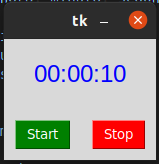

## entry
### esto nos sirve para poner un usuario y una contraseña

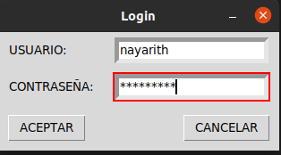

## label reloj
### esto nos sirve para ver la hora exacta

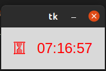

## listbox
### esto nos sirve para traducir palabras de cuatro paises diferentes
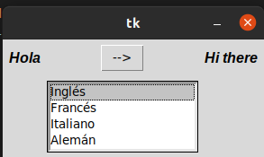

## menu 
### esto es un menu que tiene diferentes opciones
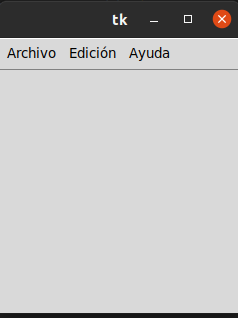

## menubutton
### esto es un formulario donde nos piden dar un nombre, direccion,sexo, provincia, edad
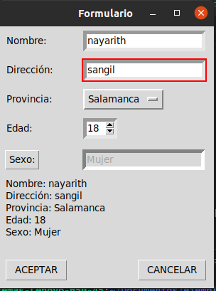

## messagebox
### esto es un menu desplegable que nos da diferentes opciones
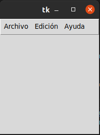

## optionmenu
### es un menu que nos pide dar diferentes datos como la edad, la provincia, el nombre y la direccion
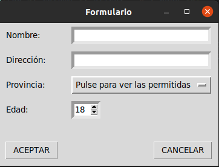

## scale arco
### esto nos sirve para medir un angulo segun los grados dados
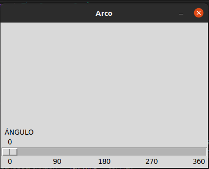

## scroll
### esto es otro menu con un tamaño mas grande que tambien contiene varias opciones
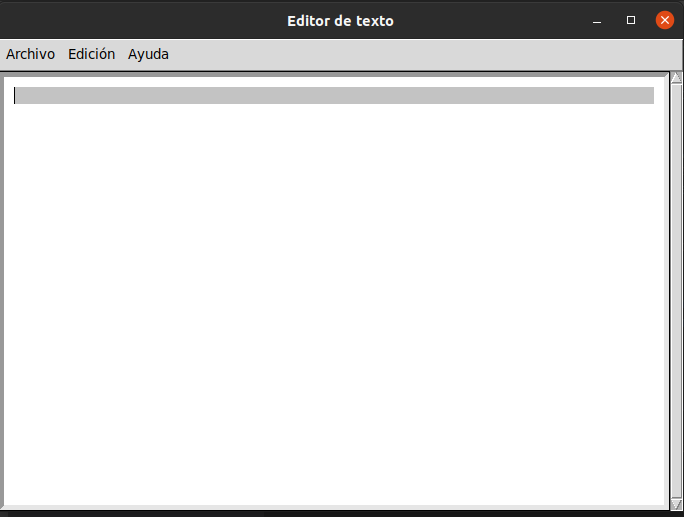

## spinbox
### esto es un formulario que contiene menos opciones que que los anteriores
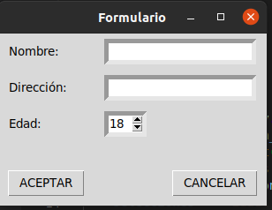

## text
### esto es un menu que es muy parecido a los anteriores 
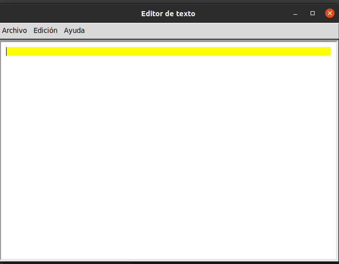

## toplevel
### esto es un menu que nos da un formulario que al dar clik en accedernos manda a una ventana donde hay un formulario que nos permite ingresar algunos datos
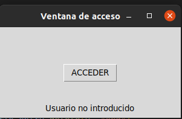